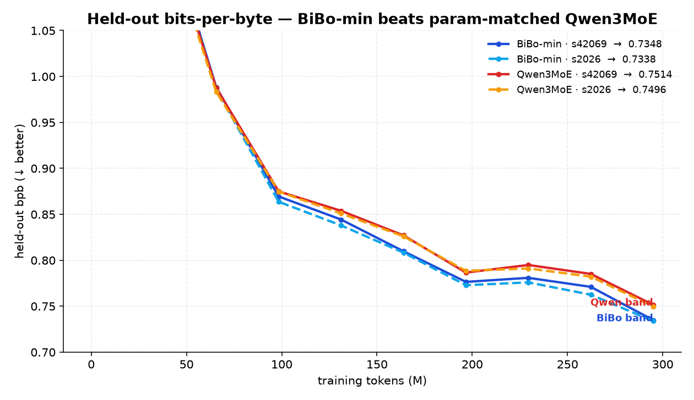
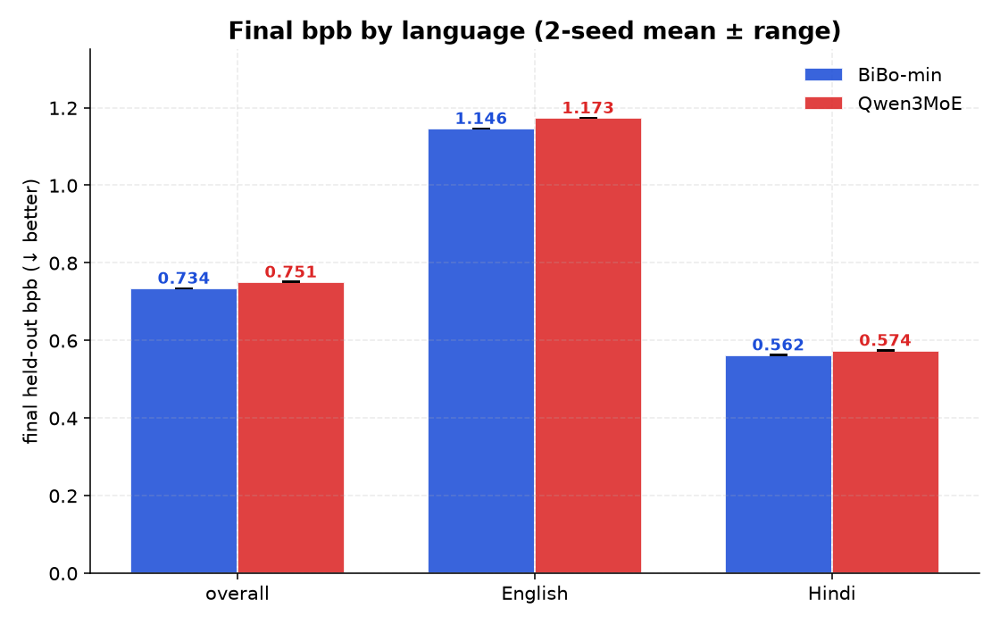
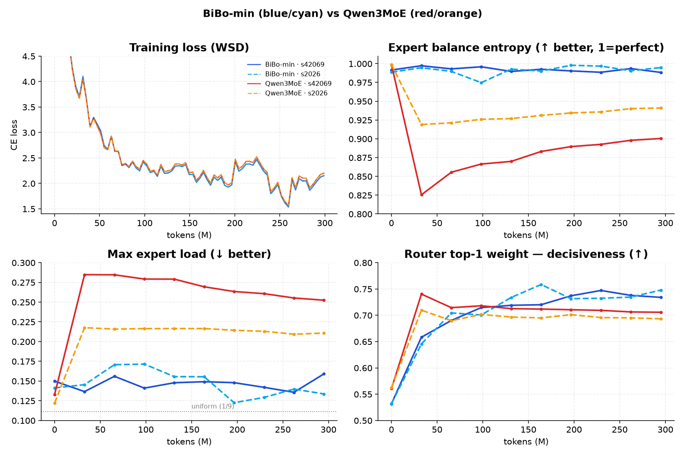
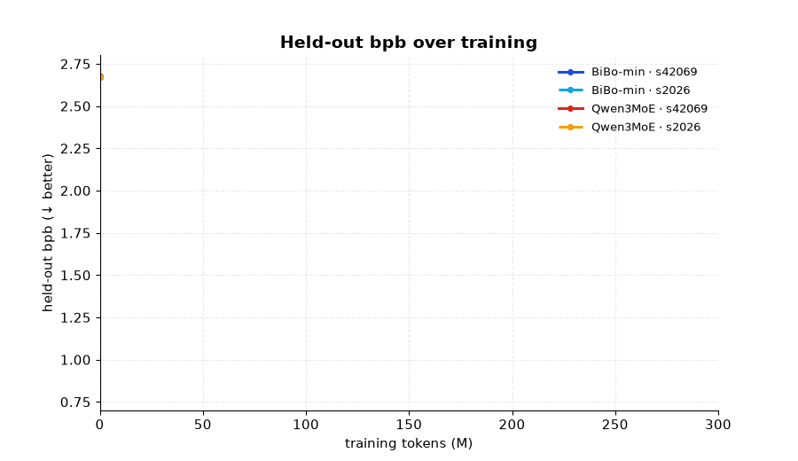

# BiBo-min vs Qwen3MoE — Certified Ablation Results

**Verdict: BiBo's core (PolyGLU experts + partial RoPE + sigmoid/bias router) beats a
parameter-matched Qwen3MoE by ~2.2% held-out bits-per-byte, robustly across 2 seeds, and
holds equally on Hindi as on English.** BiBo also balances its experts better and
extrapolates to longer context better. The only metric where Qwen leads is a near-chance
probe that swings more between its own seeds than the gap itself — i.e. noise.

- Scale: 137.94 M total / 71.88 M active params (top-2 of 9 experts), **exactly matched** between arms.
- Budget: 300 M tokens, bf16 (fp32 master weights), WSD schedule, batch 64 x seq 1024.
- Seeds: 42069 and 2026 per arm (seed changes model init only; the data stream is deterministic and identical across seeds).
- Hardware: RTX PRO 6000 Blackwell (sm120), fused kernels (Muon gram-NS, fused CE, per-expert MoE), Liger RMSNorm + RoPE.
- W&B project: [`ablations-tinycompany-ai/bibo-qwen-ablate`](https://wandb.ai/ablations-tinycompany-ai/bibo-qwen-ablate).

---

## What differs between the arms (everything else is identical)

| component | BiBo-min | Qwen3MoE (baseline) |
|---|---|---|
| experts | **PolyGLU** (SiLU / ReLU^2 / NormSiLU cycled) | SwiGLU (homogeneous SiLU) |
| RoPE | **partial** (rotary factor 0.334) | full |
| router | **sigmoid** gate + DeepSeek aux-loss-free bias balancing | softmax gate + Switch aux load-balance loss (coef 0.001) |
| shared dims, layers, experts, top-k, vocab, tied embeddings | identical | identical |

Both arms balance their experts (each in its native way), so this is a fair
balanced-vs-balanced comparison. Params match exactly (PolyGLU == SwiGLU in parameter
count; partial-vs-full RoPE is parameter-free).

---

## Headline: held-out bits-per-byte



The BiBo band sits below the Qwen band and the gap widens through training. Final numbers
(full held-out eval; lower is better):

| arm | seed 42069 | seed 2026 | mean | seed spread |
|---|---|---|---|---|
| Qwen3MoE | 0.7506 | 0.7484 | 0.7495 | 0.0022 |
| **BiBo-min** | **0.7339** | **0.7326** | **0.7333** | 0.0013 |

**Gap = 0.0162 (-2.2%).** Within-arm seed spread is <= 0.0022, so the gap is ~7-12x the
seed noise. The seed ranges do not overlap: BiBo's worst seed (0.7339) still beats Qwen's
best seed (0.7484) by 0.0145. Complete rank separation across seeds — the result is not
init luck.



---

## Every metric (2-seed means; final eval)

| metric | direction | BiBo-min | Qwen3MoE | winner |
|---|---|---|---|---|
| bpb_overall | lower | **0.7333** | 0.7495 | BiBo (-2.2%) |
| bpb_en (English) | lower | **1.1545** | 1.1824 | BiBo (-2.4%) |
| bpb_hi (Hindi) | lower | **0.5609** | 0.5723 | BiBo (-2.0%) |
| expert_balance_entropy | higher (1=perfect) | **0.9928** | 0.9212 | BiBo |
| max_expert_load | lower (0.111=uniform) | **0.138** | 0.231 | BiBo |
| extrap_degradation_en (1024->2048) | lower (1=none) | **1.0383** | 1.0449 | BiBo |
| extrap_degradation_hi | lower | **1.0387** | 1.0474 | BiBo |
| router_top1_weight | higher = decisive | **0.740** | 0.699 | BiBo |
| router_entropy | lower = decisive | **0.513** | 0.572 | BiBo |
| acc_en (LL-MCQ, ~0.25 chance) | higher | 0.317 | 0.301 | tie (noise) |
| acc_hi (LL-MCQ) | higher | 0.290 | 0.284 | tie (noise) |
| probe_en | higher | 0.763 | 0.813 | Qwen (noise) |

BiBo wins every low-noise axis: all three bpb splits, both balance metrics, both
length-extrapolation metrics, and router decisiveness. The MCQ accuracies are near 4-way
chance at 137 M params (expected — not the signal), and `probe_en` swings 0.775->0.85
between Qwen's own two seeds, so it carries no signal.



### Animated convergence



---

## How to read this / methodology

- **bpb is the metric.** Held-out bits-per-byte is per-token dense (tight standard error),
  tokenizer-independent, and measures pure language-modeling quality. MCQ accuracy is
  per-item and near chance at this scale, so it is reported but down-weighted.
- **Eval bpb excludes the aux loss.** It is pure next-token cross-entropy on held-out text
  (`eval/bpb.py`), never the training objective. The Switch aux term lives only in the
  training loss, so both arms are scored on the identical objective. If anything this is
  generous to Qwen (its bpb carries no aux penalty).
- **Balancing is fair, each arm native.** BiBo uses DeepSeek-style aux-loss-free bias
  updates; Qwen uses the Switch load-balancing loss (coef 0.001, the Qwen paper default).
  BiBo's router is measurably better balanced (entropy 0.99 vs 0.92; top expert 1.3x
  uniform vs 2.3x) while also being more decisive per token — it balances load without
  flattening the per-token gate weights.
- **Hindi is a first-class, separately-reported segment**, not folded into an average.

---

## Training efficiency (context, not a claim)

| run | tokens/s | MFU | ms/step | wall (min) |
|---|---|---|---|---|
| BiBo-min s42069 | 206k | 21.2% | 318 | 44 |
| BiBo-min s2026 | 247k | 25.4% | 266 | 39 |
| Qwen3MoE s42069 | 246k | 25.4% | 266 | 36 |
| Qwen3MoE s2026 | 257k | 26.4% | 255 | 34 |

These single-interval snapshots are noisy and order-dependent (the first run ran on cold
clocks); do not read an arm-vs-arm speed difference into them. Peak memory (BiBo ~20 GB vs
Qwen ~25 GB at matched CE buffer) reflects a real architectural difference in the Qwen
attention/aux path, separate from modeling quality.

---

## Reproduce

```bash
python -m ablate.common.train \
  --arm bibo_min \            # or: qwen
  --dataset tinycompany/Better-Instruct-packed-2 \
  --tokens 300000000 --batch 64 --seq_len 1024 --precision bf16 --attn sdpa \
  --patches liger_norm,liger_rope,ce,moe --muon_lr 3e-4 --adam_lr 3e-4 --wd 0.1 --grad_clip 1.0 \
  --load_balance bias --bias_update_threshold 10240 --aux_coef 0.001 \
  --polyglu_mult 3 --special_pairs 0 \
  --eval_every 500 --sample_every 500 --seed 42069 \
  --wandb --wandb_project bibo-qwen-ablate
```

## Provenance

| run | W&B id | tokens | date |
|---|---|---|---|
| bibo_min s42069 | `cpkr3f69` | 300 M | 2026-07-08 |
| bibo_min s2026 | `xu0mbffr` | 300 M | 2026-07-09 |
| qwen s42069 | `aqbrivbr` | 300 M | 2026-07-08 |
| qwen s2026 | `l0yv799o` | 300 M | 2026-07-08 |

Charts generated from the W&B run history (`assets/`). Table values are each run's final
full-eval summary; the convergence curves are the periodic (every-500-step) evals.
