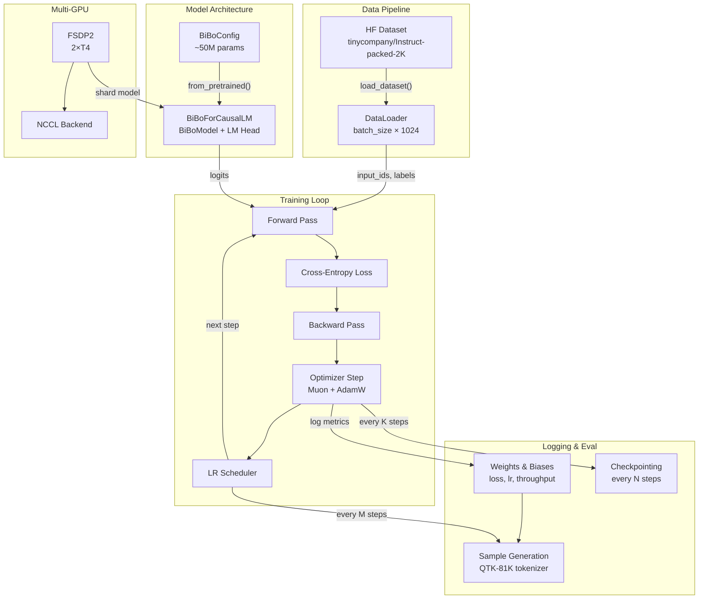
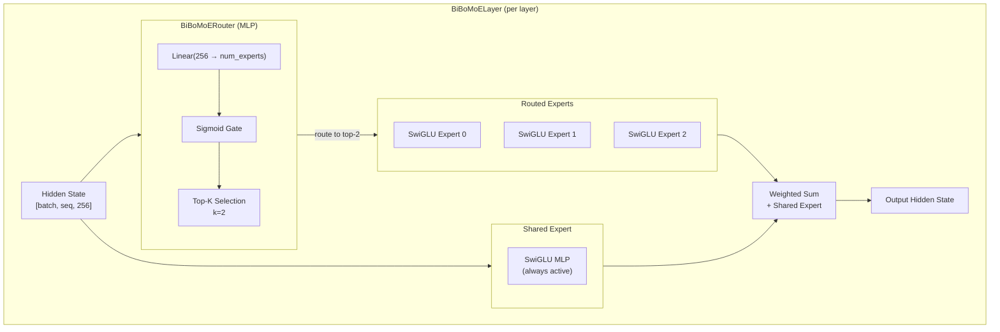
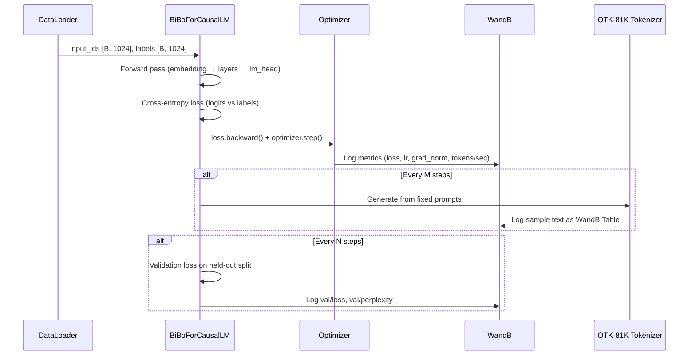
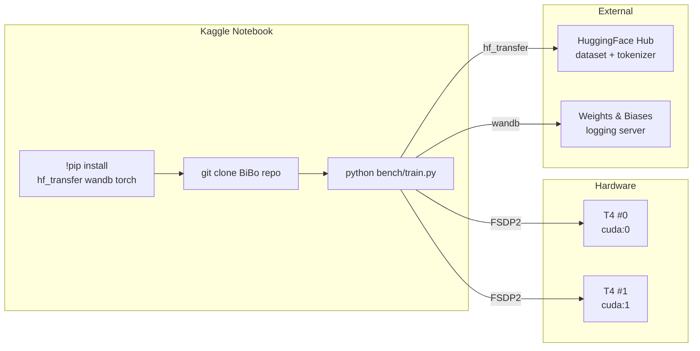

# BiBo Benchmark — Architecture

## System Overview



---

## MoE Layer Architecture (Baseline BiBo)



---

## Data Flow



---

## File Structure

```
bench/
├── train.py           # Main entry: arg parsing, training loop, FSDP2 setup
├── config.py          # BiBoConfig for ~50M baseline (no PolyGLU)
├── data.py            # Dataset loading, truncation to 1024, train/val split
├── optim.py           # Muon + AdamW setup, LR scheduler
├── eval.py            # Eval loop + sample generation with QTK-81K
├── utils.py           # WandB init, checkpointing, metrics, helpers
├── run.sh             # Kaggle entry point (pip install, launch training)
└── README.md          # Usage, config options, expected results
```

**File responsibilities:**

| File | Owns | Imports From |
|------|------|-------------|
| `train.py` | Training loop, arg parsing, FSDP2 wrapping, torch.compile | config, data, optim, eval, utils |
| `config.py` | BiBoConfig initialization, param count validation | src.configuration_bibo |
| `data.py` | HF dataset loading, truncation, DataLoader creation | datasets, torch |
| `optim.py` | Optimizer creation (Muon/AdamW), LR scheduler | torch.optim, kellerjordan (optional) |
| `eval.py` | Validation loss computation, sample generation | transformers (tokenizer), torch |
| `utils.py` | WandB init/logging, checkpointing, gradient clipping | wandb, torch |

---

## Deployment (Kaggle)



---

## Key Architecture Decisions

| Decision | Choice | Rationale |
|----------|--------|-----------|
| FSDP2 vs DDP | FSDP2 | Shards model across GPUs, lower memory per GPU, better for scaling to larger models |
| torch.compile mode | reduce-overhead | Best throughput for fixed-shape inputs (packed sequences) |
| fullgraph=False | Required | MoE routing is data-dependent (top-k selection breaks fullgraph) |
| Muon + AdamW | Hybrid | Muon for embeddings (proven on NanoGPT), AdamW for rest (stable for MoE) |
| Dataset truncation | 1024 from 2048 | User requirement: cap at 1024 starting tokens |
| Tokenizer usage | Inference only | Data is pre-tokenized, tokenizer only for decode/samples |
| Gradient clipping | max_norm=1.0 | Standard for MoE training, prevents exploding gradients |
| Mixed precision | fp16 (amp) | T4 has no native bf16, fp16 via autocast is stable |
